# ESP-NOW-RC-CAR

##硬體

### 材料

| 品名                      |   數量   |               圖片                 |
| --------                  |-------- |           --------                 |
| ESP-32                    |   2     | 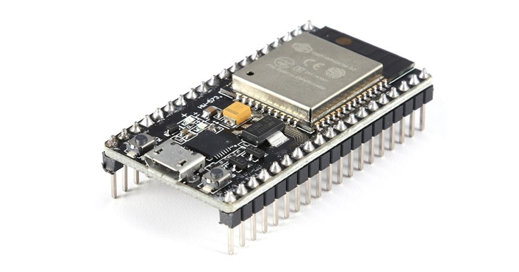        |
| 雙軸搖桿                   |   2     | 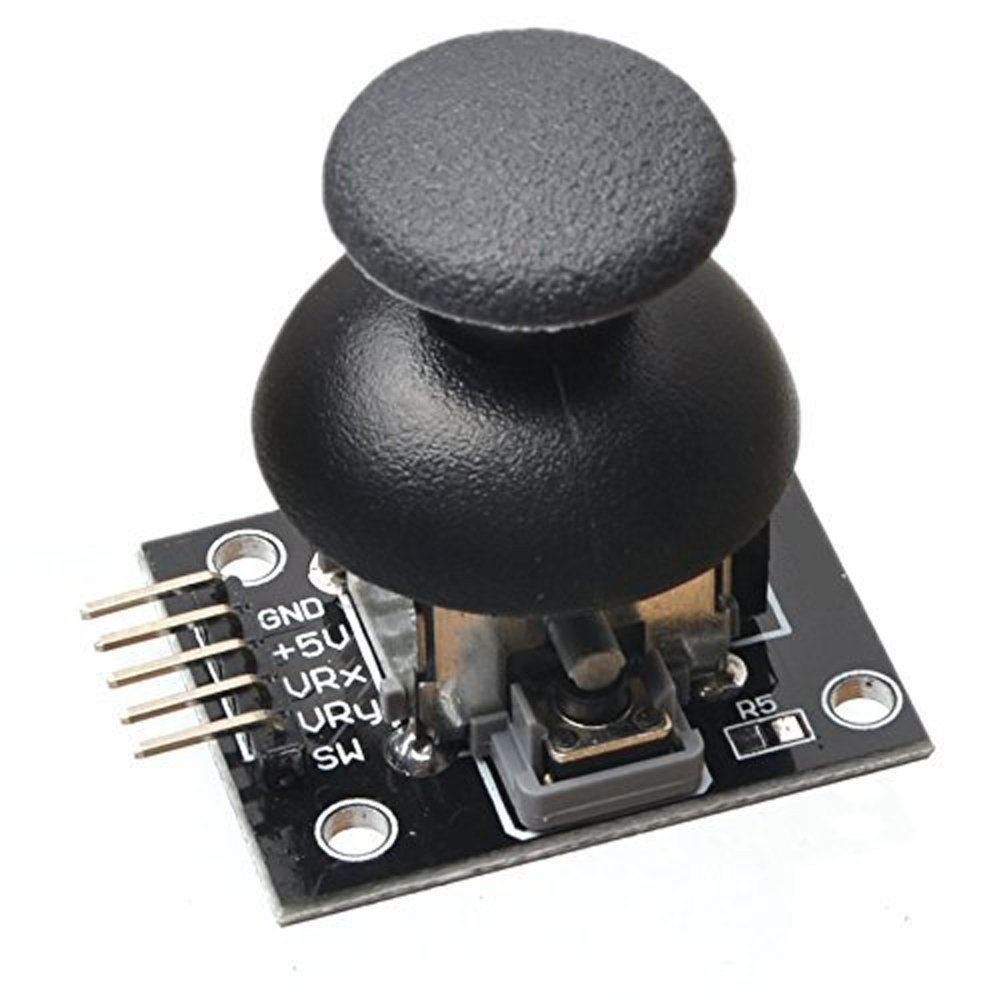           |
| L298N OR MX1508           |   2     | 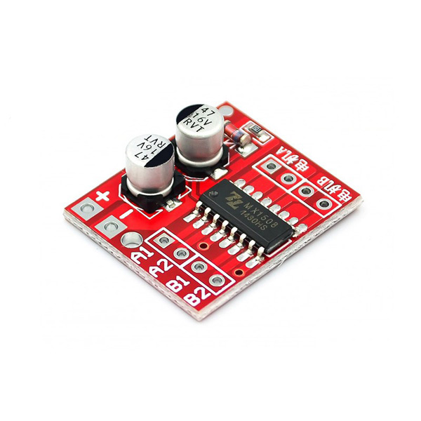             |
| 18650電池                  |   1    | 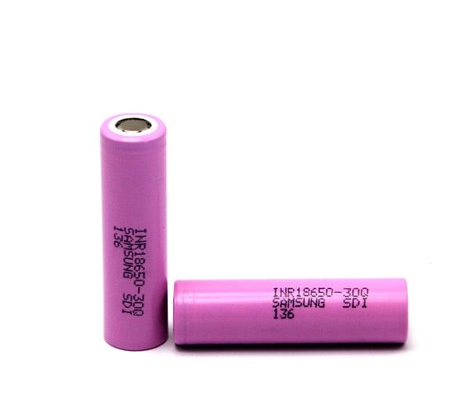       |
| 18650電池盒                |   1     | 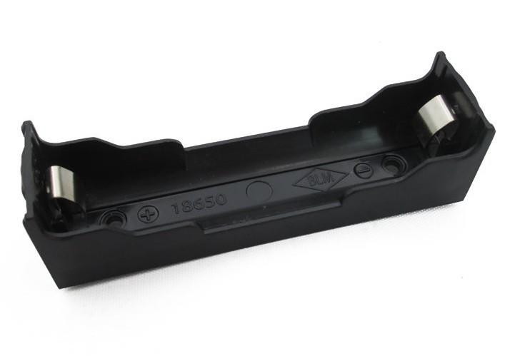 |
| 按鍵開關                   |   5     | 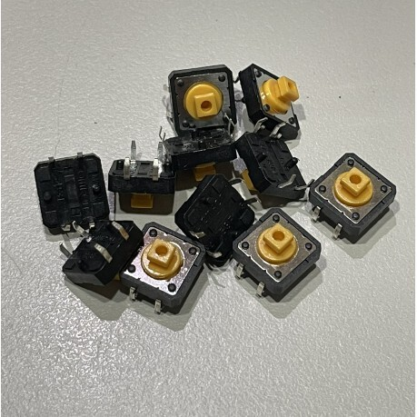
| 滑動開關                   |   2     | 
| AMS1117-3.3V穩壓模組       |   2     | 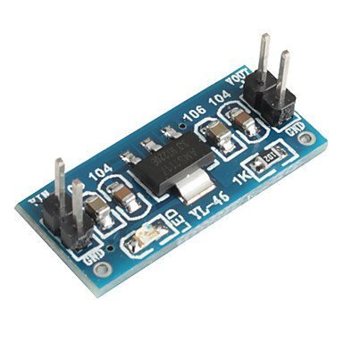
| TP4056鋰電池充電板模組      |   1     | 
| 白色LED                    |   few   | 
| 紅色LED                    |   few   | 
| 黃色LED                    |   few   | 
| 200Ω電阻                   |   few   |
| 5\*7cm洞洞板               |   1   |
| 7\*9cm洞洞板               |   2   |
| 排針                       |   few   |
| 接線端子                   |   3   |
| 11\*11\*5mm鋁散熱片        |   2   |
| ipex天線                   |   2   |
| 2cm銅柱                    |   few   |
| M3螺絲                     |   few   |
| M3螺母                     |   few   |
| 導線                       |   few   |

### 控制端
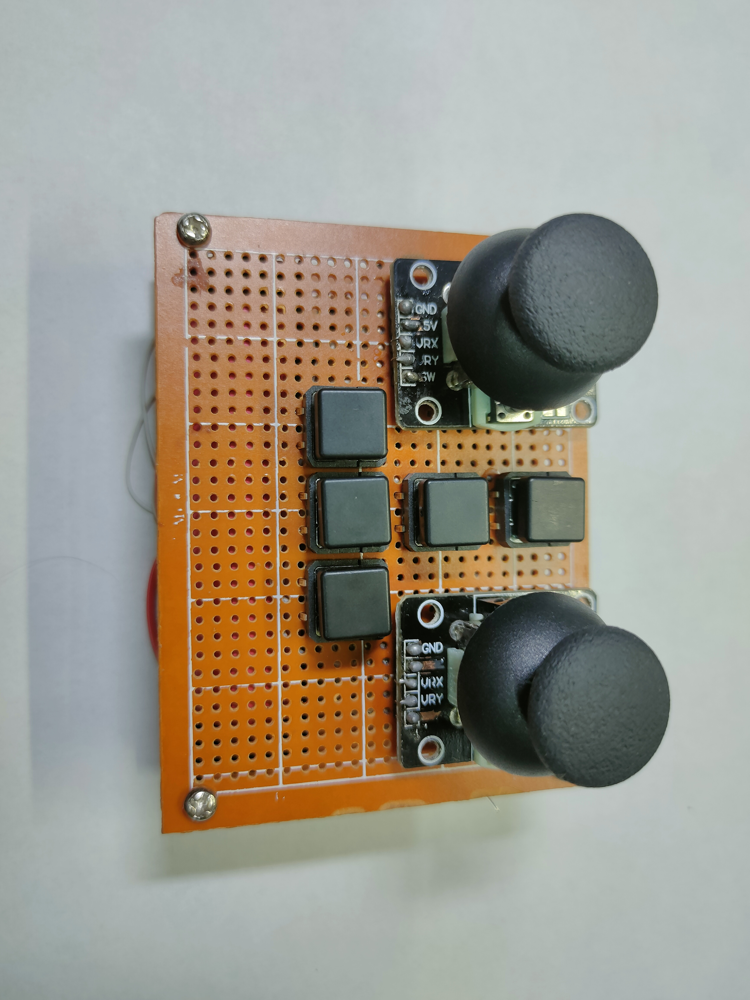
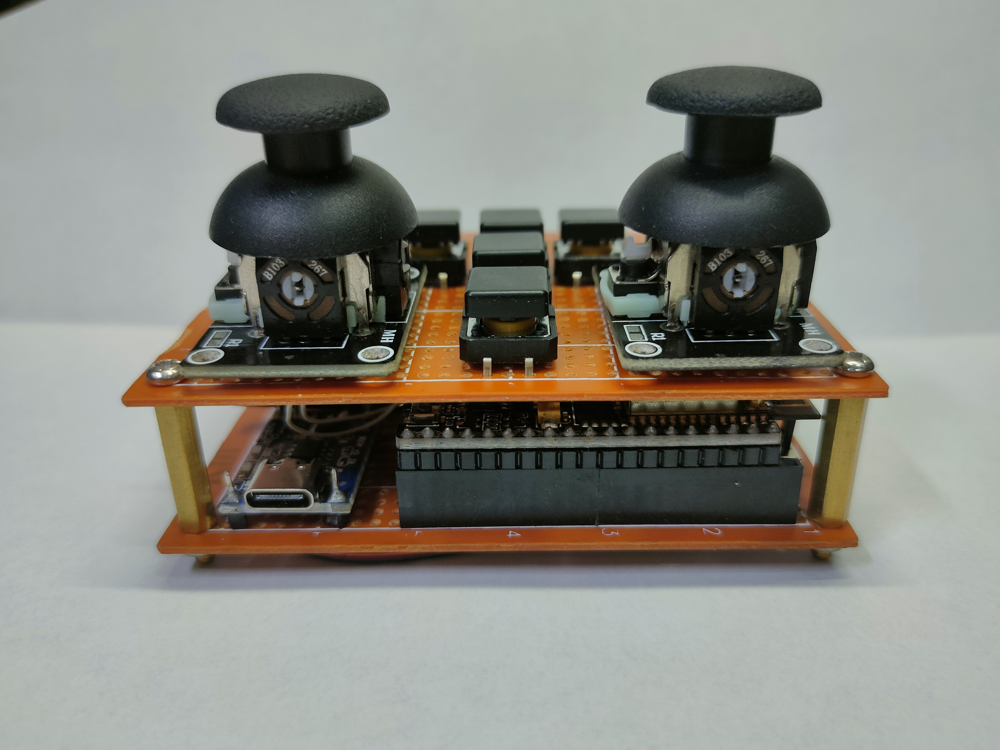
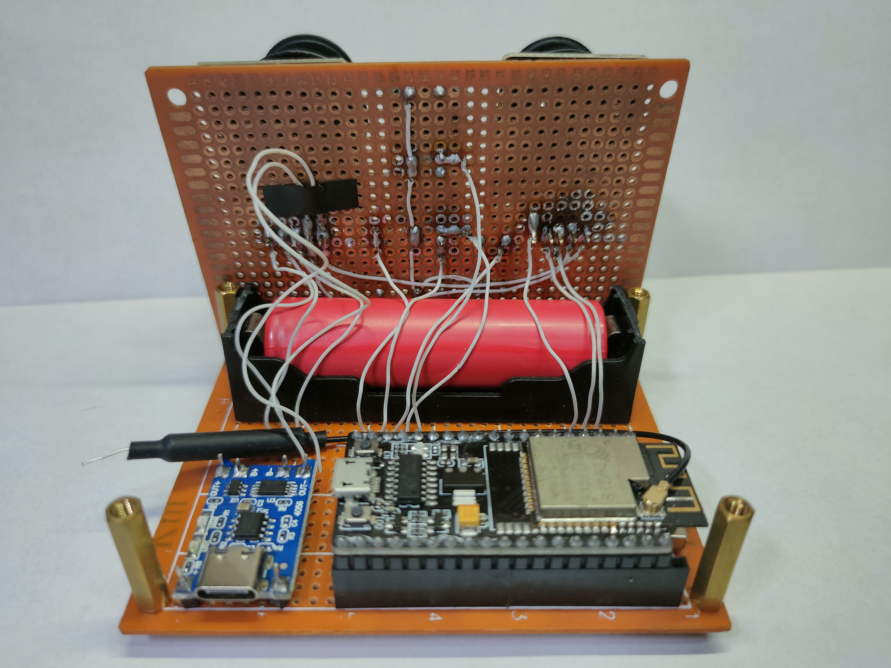

### 接收端
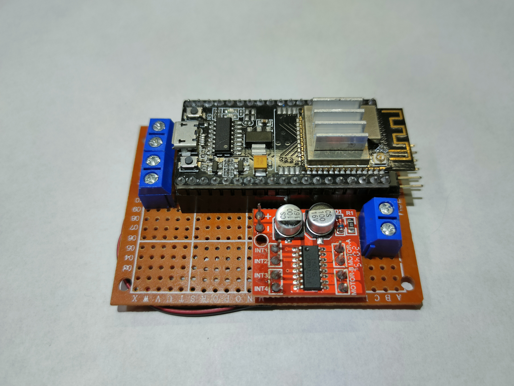

## 軟體

### 取得 MAC Address

``` cpp
#include <WiFi.h>

void setup() {
  Serial.begin(115200);
  Serial.println();
#ifdef ESP8266
  Serial.print("ESP8266 Board MAC Address:  ");
  Serial.println(WiFi.macAddress());
#elif defined ESP32
  WiFi.mode(WIFI_MODE_STA);
  Serial.print("ESP32 Board MAC Address:  ");
  Serial.println(WiFi.macAddress());
#endif
}
```

將 MAC Address = `[]:[]:[]:[]:[]:[]` 填入控制端

``` cpp
uint8_t broadcastAddress[] = {0x[], 0x[], 0x[], 0x[], 0x[], 0x[]};
```
